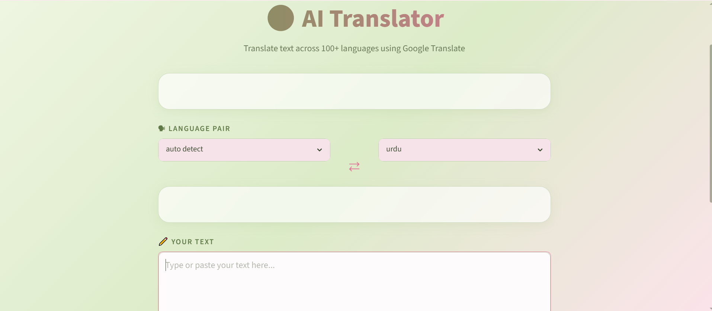

# AI Language Translation Tool

Web app that translates text between 100+ languages and plays the result as audio. Built with Python and Streamlit, using Google Translate through the `deep-translator` library.



## Features

- Translates text between the languages supported by Google Translate (100+)
- Auto-detects the source language
- Text-to-speech playback of the translation (gTTS)
- Copy button for the translated text
- Dark-themed Streamlit interface

## Tech Stack

| Technology | Purpose |
|---|---|
| Python 3.x | Core language |
| Streamlit | Web UI |
| deep-translator | Wrapper for Google Translate |
| gTTS | Google Text-to-Speech |

## Project Structure

```
language-translation-tool/
├── app.py            # Streamlit UI
├── translator.py     # Translation logic
├── requirements.txt  # Python dependencies
├── demo.png          # App screenshot
├── README.md
└── .gitignore
```

## How to Run Locally

```bash
# 1. Clone the repo
git clone https://github.com/ash-1212/translation-tool.git
cd language-translation-tool

# 2. Create and activate a virtual environment
python -m venv venv
venv\Scripts\activate          # Windows
source venv/bin/activate       # macOS / Linux

# 3. Install dependencies
pip install -r requirements.txt

# 4. Start the app
python -m streamlit run app.py
```

Then open http://localhost:8501 in your browser.

## How It Works

```
User enters text and selects languages
        ↓
Streamlit UI captures the input
        ↓
translator.py sends the text to Google Translate
        ↓
Translated text is returned
        ↓
Result is displayed and audio is generated
```

## Notes

- An internet connection is required, because translation and text-to-speech both use Google services.
- Translation quality depends on Google Translate. The app does not include its own trained model.

## Author

**Ayesha Nazish**
Built during the CodeAlpha AI Internship.
[GitHub](https://github.com/ash-1212) · [LinkedIn](https://www.linkedin.com/in/ayeshanazish-452048274)

## License

MIT License. See the [LICENSE](LICENSE) file.
